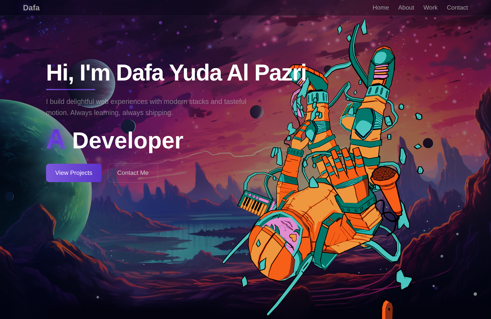

# 3D Developer Portfolio

A modern, interactive 3D portfolio website built with React, Three.js, and TailwindCSS. Features immersive animations and cutting-edge web technologies to create a memorable user experience.



---

## Table of Contents

- [Features](#features)
- [Tech Stack](#tech-stack)
- [Project Structure](#project-structure)
- [Getting Started](#getting-started)
- [Configuration](#configuration)
- [Assets](#assets)
- [Contact](#contact)
- [License](#license)
- [Credits](#credits)

---

## Features

- Interactive 3D graphics powered by React Three Fiber and Drei
- Smooth scroll-based animations using Framer Motion
- Responsive design with TailwindCSS
- Working contact form with EmailJS integration
- Enhanced UI components from Aceternity UI and Magic UI
- Optimized performance with Vite

---

## Tech Stack

| Technology | Purpose |
|------------|---------|
| React | Frontend framework |
| Vite | Build tool and dev server |
| TailwindCSS | Styling framework |
| React Three Fiber | 3D rendering with Three.js |
| Drei | Three.js helpers for React |
| Framer Motion | Animation library |
| EmailJS | Contact form service |
| Aceternity UI | UI components |
| Magic UI | Additional UI elements |

---

## Project Structure
```
Portfolio/
├── public/
│   ├── assets/          # Images, textures, icons
│   ├── models/          # 3D models (GLTF/GLB)
│   └── vite.svg
├── src/
│   ├── components/      # Reusable components
│   ├── constants/       # Configuration data
│   ├── sections/        # Main sections (Hero, About, Projects, Contact)
│   ├── App.jsx          # Main component
│   ├── index.css        # Global styles
│   └── main.jsx         # Entry point
├── tailwind.config.js
├── vite.config.js
└── package.json
```

---

## Getting Started

### Prerequisites

- Node.js v18 or higher
- npm or yarn

### Installation

Clone the repository:
```bash
git clone https://github.com/dafayudaalpazri/Portfolio.git
cd Portfolio
```

Install dependencies:
```bash
npm install
```

Start development server:
```bash
npm run dev
```

Open browser at `http://localhost:5173`

### Build for Production
```bash
npm run build
```

Output will be in the `dist/` folder.

---

## Configuration

### Customize Content

Edit `src/constants/index.js` to update:
- Personal information
- Projects and work experience
- Skills and technologies
- Social media links

### Customize Theme

Modify `tailwind.config.js` to change:
- Color schemes
- Fonts
- Spacing and sizing
- Breakpoints

### EmailJS Setup

1. Create account at [EmailJS](https://www.emailjs.com/)
2. Set up email service and template
3. Update credentials in contact form component

---

## Assets

Download all project assets (images, 3D models, textures):

[Download Assets](https://github.com/user-attachments/files/19820923/public.zip)

Assets include:
- 3D models and objects
- Background images and textures
- Icons and logos
- Project screenshots

---

## Contact

**Dafa Yuda Al Pazri**

[](https://www.tiktok.com/@initial_d28)
[](https://www.instagram.com/dafayudaalpazri_/)
[](https://github.com/dafayudaalpazri)

---

## License

This project is open source and available under the MIT License.

---

## Credits

This project is a modified version of the original 3D Developer Portfolio created by Ali Sanati.

### Original Author

**Ali Sanati**

[](https://www.instagram.com/ali.sanatidev/)
[](https://www.youtube.com/channel/UCZhtUWTtk3bGJiMPN9T4HWA)
[](https://www.linkedin.com/in/ali-sanati/)

- Original Repository: [Ali-Sanati/Portfolio](https://github.com/Ali-Sanati/Portfolio)
- Tutorial Video: [Watch on YouTube](https://youtu.be/S9UQItTpwUQ)

### Modifications

This version includes personalized content, custom styling, and additional features while maintaining the core functionality of the original project.

---

<div align="center">

**Made by Dafa Yuda Al Pazri** | Modified from original work by Ali Sanati

</div>